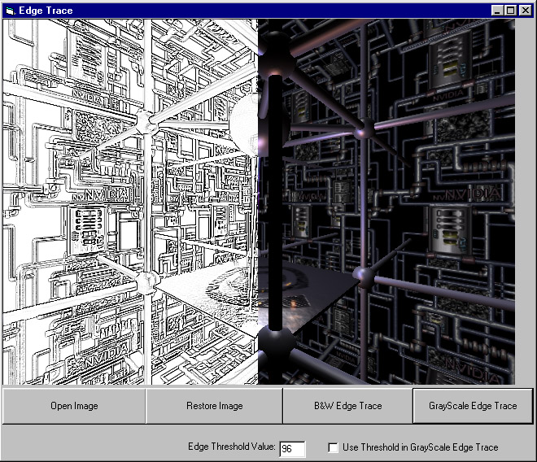



## Edge Tracer

### Description

UPDATED!!

Does a really impressive Edge Trace operation on a picture.

It has 2 modes of Edge Tracing.

B&W Edge Trace: Any pixel with a difference larger than the Edge Threshold Value is set to Black

GrayScale Edge Trace: Also shows how much difference is there.

Now has 2 modes of edge tracing. One is more accurate. The other produces finer and sharper edge traces though less accurate.

(Thanks for your feedback Rang3r!!)

Any comments for improvement?
 
### More Info
 
A Picture

An Edge Trace

No Known

             |
---                |---
**Submitted On**   |2000-11-04 00:10:08
**By**             |[Liu Yucheng](https://github.com/Planet-Source-Code/PSCIndex/blob/master/ByAuthor/liu-yucheng.md)
**Level**          |Intermediate
**User Rating**    |4.8 (53 globes from 11 users)
**Compatibility**  |VB 4\.0 \(32\-bit\), VB 5\.0, VB 6\.0
**Category**       |[Graphics](https://github.com/Planet-Source-Code/PSCIndex/blob/master/ByCategory/graphics__1-46.md)
**World**          |[Visual Basic](https://github.com/Planet-Source-Code/PSCIndex/blob/master/ByWorld/visual-basic.md)
**Archive File**   |[CODE\_UPLOAD112591132000\.zip](https://github.com/Planet-Source-Code/liu-yucheng-edge-tracer__1-12494/archive/master.zip)

